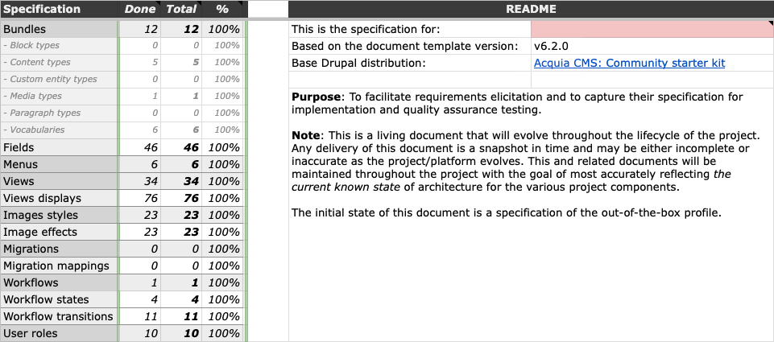

# Drupal Spec Tool

[](https://packagist.org/packages/acquia/drupal-spec-tool) [](https://travis-ci.org/acquia/drupal-spec-tool)

This project provides a tool for specifying Drupal architecture details and generating automated tests for them. It consists of 1) [a Google Sheet](#google-sheet) for capturing specification and generating tests from it and 2) the Behat contexts that automate the generated tests ([examples](../features)).

## Getting started

### Google sheet

Copy [the current version of the Google sheet](https://docs.google.com/spreadsheets/d/1FC2HSsumZUMOr83rq8mmI8g9l8g_peI_pEBnc79-Rks/edit?usp=sharing) to your Google Drive.



### Behat tests

Assuming you already have [Behat installed](http://behat.org/en/latest/quick_start.html#installation) via [Composer](https://getcomposer.org/)...

1. Install the Behat contexts:

    ```bash
    composer require --dev acquia/drupal-spec-tool
    ```

1. Add the new contexts to your [Behat configuration](http://behat.org/en/latest/user_guide/configuration.html), e.g.:

    ```yaml
    # behat.yml
    default:
      suites:
        default:
          contexts:
            - Acquia\DrupalSpecTool\Context\AccessControlContext
            - Acquia\DrupalSpecTool\Context\ContentModelContext
            - Acquia\DrupalSpecTool\Context\MediaContext
            - Acquia\DrupalSpecTool\Context\MenuContext
            - Acquia\DrupalSpecTool\Context\ViewsContext
            - Acquia\DrupalSpecTool\Context\WorkflowContext
    ```

1. Copy [the default feature files](../features) (representing the out-of-the-box configuration of Lightning) to your features directory. For example, given a [BLT](https://github.com/acquia/blt)-based project:

    ```bash
    mkdir tests/behat/features/drupal-spec-tool
    cp vendor/acquia/drupal-spec-tool/features/*.feature tests/behat/features/drupal-spec-tool/
    ```

1. As you change the specification, update the features to match using the generated Gherkin  on the "Behat" tab of the Google sheet. (See [Advanced](#advanced) below to automate this process.)

1. Run Behat! If the tests pass, your application matches the specification. If not, change one or the other according to your needs.

## Usage

Learn more about the features of the tool and best practices for using it in [the announcement blog post on the Acquia Developer Center](https://dev.acquia.com/blog/a-specification-tool-for-drupal-8-/30/05/2018/19606).

## Advanced

Automate test updates with [`nickwilde1990/drupal-spec-tool-commands`](https://packagist.org/packages/nickwilde1990/drupal-spec-tool-commands).

## Known issues

[See open bug reports in the issue queue.](https://github.com/acquia/drupal-spec-tool/labels/bug)

## Contribution

Contributions are welcome! See [CONTRIBUTING.md](CONTRIBUTING.md).

## License

Copyright (C) 2018 Acquia, Inc.

This program is free software: you can redistribute it and/or modify it under the terms of the GNU General Public License version 2 as published by the Free Software Foundation.

This program is distributed in the hope that it will be useful, but WITHOUT ANY WARRANTY; without even the implied warranty of MERCHANTABILITY or FITNESS FOR A PARTICULAR PURPOSE. See the GNU General Public License for more details.
