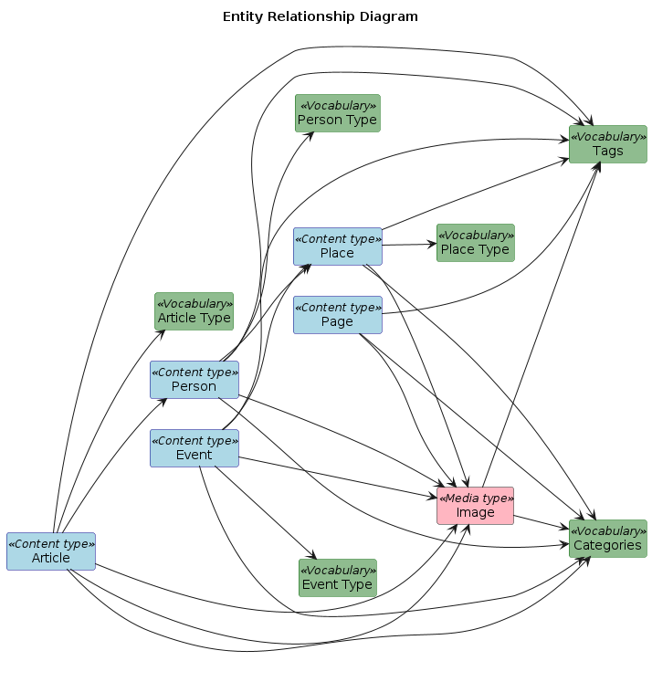
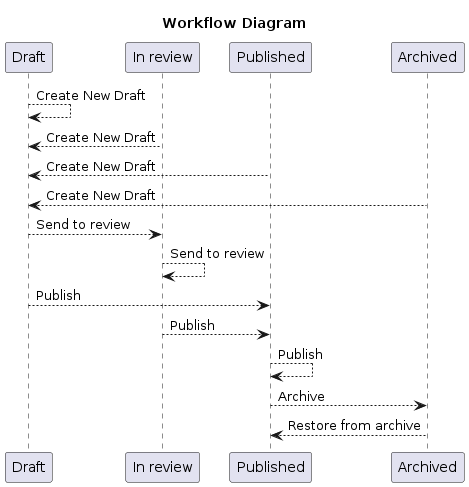

# Diagrams

The "Diagrams" tab of the Google Sheet provides [PlantUML](https://plantuml.com/) code for generating diagrams from your model. Examples:

#### Entity relationship diagram (ERD)

#### Workflow diagram

